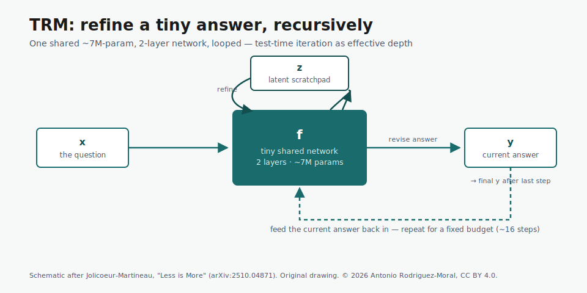

# recursive-reasoning-models

*Reading the recursive-reasoning thread critically — HRM, TRM, and what their results actually show.*

[](LICENSE)
[](https://creativecommons.org/licenses/by/4.0/)
[](https://arodmor.github.io)
[](https://arodmor.me)
[](#sources)

## Why this repo

A small class of models has been making an outsized claim: that you can get strong
abstract-reasoning results from a **tiny** network that *iterates*, rather than a
giant one that's scaled. **TRM** (Tiny Recursive Models, ~7M parameters) reportedly
reaches **~45% on ARC-AGI-1** — and won the **ARC Prize 2025 Paper Award**. That's
worth understanding properly, and worth reading *critically*: later analyses argue a
good share of the performance comes from efficiency, task-specific conditioning and
heavy test-time compute rather than "deep reasoning."

This repo is my literature map and mechanism explainer for that thread — what the
idea is, how TRM actually works, and how to read its numbers without over-claiming.

> **Round 1 — analysis & explainer.** This first pass is public-information analysis
> (literature map, mechanism explainer, an original architecture diagram, and a
> critical reading). A later round will add **hands-on reproductions** — small,
> honest, dated runs using the official MIT code — see the [Roadmap](#roadmap).

> **Attribution discipline.** Every reported number below is *the source's*, not
> mine, and is cited as such. Dates and links are in [Sources](#sources),
> re-verified **2026-06-20**.

## Contents

1. [The core idea](#1-the-core-idea)
2. [TRM, in brief](#2-trm-in-brief)
3. [A critical reading](#3-a-critical-reading)
4. [Why it matters for ARC Prize 2026](#4-why-it-matters-for-arc-prize-2026)
5. [Roadmap](#5-roadmap)
6. [Sources](#sources)

Deeper notes live in [`notes/`](notes/): a [literature map](notes/literature-map.md)
(HRM → TRM → critiques/variants) and a [mechanism explainer](notes/how-trm-works.md).

---

## 1. The core idea

Most large language models reason **autoregressively** — one token at a time, with
"thinking" externalised as more generated text. Recursive-reasoning models make a
different bet: keep the network **tiny** and instead **iterate internally**. The
model holds a latent "scratchpad" and a current answer, and repeatedly **refines
both** over many steps before committing. The slogan version: **test-time compute as
effective depth** — depth you get by looping a small network, not by stacking layers
or scaling parameters.

It's a *draft-then-revise* loop rather than a left-to-right decode: propose an
answer, critique it against the problem, revise, repeat. The appeal is efficiency —
if it works, you get strong reasoning from a model small enough to run inside a
sandbox with no internet and no hosted API.

## 2. TRM, in brief

**TRM — "Less is More: Recursive Reasoning with Tiny Networks"** (Alexia
Jolicoeur-Martineau, **Samsung SAIL Montréal**,
[arXiv:2510.04871](https://arxiv.org/abs/2510.04871)):

- **Size:** a single shared **~7M-parameter, 2-layer** network — recursing, not deep.
- **Mechanism:** it recursively updates a latent state `z` and an answer embedding
  `y` given the question, the current answer and the current latent — progressively
  improving the answer over a fixed budget of supervision steps. Trained **from
  scratch** with heavy augmentation (not few-shot prompting). Full walk-through in
  [`notes/how-trm-works.md`](notes/how-trm-works.md).
- **Reported results (the paper's, not mine):** **~45% on ARC-AGI-1**, **~8% on
  ARC-AGI-2**, **Sudoku-Extreme 87.4%**, **Maze-Hard 85.3%** — reported to beat much
  larger models (DeepSeek-R1, o3-mini-high, Gemini 2.5 Pro) on those public evals
  with **<0.01%** of their parameters.
- **Lineage:** builds on **HRM** (Hierarchical Reasoning Model,
  [arXiv:2506.21734](https://arxiv.org/abs/2506.21734)); TRM removes HRM's two-module
  hierarchy and fixed-point math, and is simpler for it.
- **Recognition:** **ARC Prize 2025 Paper Award (1st place)** (ARC Prize 2025
  Technical Report).
- **Code:** [`SamsungSAILMontreal/TinyRecursiveModels`](https://github.com/SamsungSAILMontreal/TinyRecursiveModels)
  — **MIT licensed**, so it's safe to reproduce and build on.



## 3. A critical reading

The headline — "7M params beats frontier models" — is the kind of claim that should
invite scrutiny rather than applause, so here's the balancing view.

A follow-up analysis, **"Tiny Recursive Models on ARC-AGI-1: Inductive Biases,
Identity Conditioning, and Test-Time Compute"**
([arXiv:2512.11847](https://arxiv.org/abs/2512.11847)), argues TRM's ARC-AGI-1 result
"arises from an interaction between efficiency, task-specific conditioning, and
aggressive test-time compute rather than deep internal reasoning." Specifically:

- **Test-time compute does heavy lifting.** A voting pipeline with ~1000 samples adds
  roughly **+11 percentage points** over single-pass inference.
- **Puzzle-ID (identity) conditioning is load-bearing.** Replacing the puzzle
  identifier with blank or random tokens **drops accuracy to zero** — the model leans
  hard on task-specific identifiers, not purely on the grids.
- **The recursion is shallow in practice.** Most of the accuracy appears at the first
  recursion step and plateaus after a few latent updates — so "deep iterative
  reasoning" overstates what's happening.
- **The efficiency is real, though.** TRM genuinely uses far less memory and runs at
  higher throughput than fine-tuned multi-billion-parameter baselines.

The honest synthesis: TRM is a **genuinely efficient architecture with a clever
training recipe**, and the "tiny beats giant" framing is partly an artefact of
task-specific conditioning plus a lot of test-time sampling. Both things are true —
and a public repo about it should say so. (Related variants, e.g. a **Mamba-2
attention hybrid**, [arXiv:2602.12078](https://arxiv.org/abs/2602.12078), are tracked
in the [literature map](notes/literature-map.md).)

## 4. Why it matters for ARC Prize 2026

Recursive tiny models fit the **ARC Prize 2026 sandbox** unusually well: they're
**small, self-contained, and need no internet or hosted API** — exactly what the
[no-internet, open-source rules](https://github.com/arodmor/arc-agi#4-arc-prize-2026--the-three-tracks)
require, where giant hosted LLMs are disallowed. That makes this thread directly
relevant to the static track. Background and the broader solver lineage are in the
[**`arc-agi`** hub](https://github.com/arodmor/arc-agi) and its
[approaches tour](https://github.com/arodmor/arc-agi/blob/main/docs/approaches.md);
the static track itself is [**`arc-agi-2`**](https://github.com/arodmor/arc-agi-2).

## 5. Roadmap

Planned for the next round:

```
recursive-reasoning-models/
└── reproductions/
    ├── README.md          # what was run, on what hardware, what was found
    └── probe_trm.ipynb     # a small, tractable run/probe on the official MIT repo
```

The plan: run something **small and honest** (e.g. a Sudoku subset or a handful of
ARC tasks) on available hardware using the official MIT code, and write up exactly
what was run, the settings, and the observations — clearly separating *my* runs from
the *reported* numbers. A clear partial reproduction with caveats beats an
unsupported "I replicated SOTA."

---

## Sources

Re-verified **2026-06-20**. Reported metrics are the cited authors', not mine.

- *Less is More: Recursive Reasoning with Tiny Networks* (TRM) — <https://arxiv.org/abs/2510.04871>
- *Hierarchical Reasoning Model* (HRM) — <https://arxiv.org/abs/2506.21734>
- *Tiny Recursive Models on ARC-AGI-1: Inductive Biases, Identity Conditioning, and Test-Time Compute* — <https://arxiv.org/abs/2512.11847>
- *Tiny Recursive Reasoning with Mamba-2 Attention Hybrid* — <https://arxiv.org/abs/2602.12078>
- ARC Prize 2025: Technical Report — <https://arxiv.org/abs/2601.10904>
- Official code: `SamsungSAILMontreal/TinyRecursiveModels` (MIT) — <https://github.com/SamsungSAILMontreal/TinyRecursiveModels>

*Prose and figures in this repo are © 2026 Antonio Rodriguez-Moral, licensed
[CC BY 4.0](https://creativecommons.org/licenses/by/4.0/); code is [MIT](LICENSE).*

---
🌐 [arodmor.me](https://arodmor.me) · 💻 [github.com/arodmor](https://github.com/arodmor) · ✉️ [antonio.rodriguez.moral@pm.me](mailto:antonio.rodriguez.moral@pm.me)

*Part of a series:* [AI/ML Lab](https://arodmor.github.io) ·
[voice-ai-landscape](https://github.com/arodmor/voice-ai-landscape) ·
[arc-agi](https://github.com/arodmor/arc-agi) ·
[recursive-reasoning-models](https://github.com/arodmor/recursive-reasoning-models)
